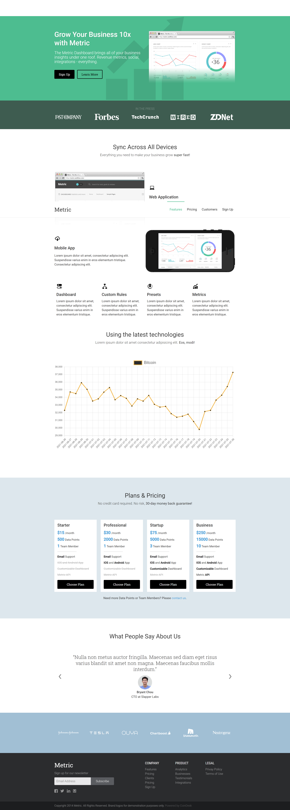

# Cópia do template Metric e uso da API CoinDesk

Clone feito para praticar HTML, CSS e JS.

[Site](https://kaio-matos.github.io/Template-Metric-e-CoinDesk/)

## Página Desktop

## Página Mobile

[Meu Linkedin](https://www.linkedin.com/in/kaio-matos-9532271a5)
